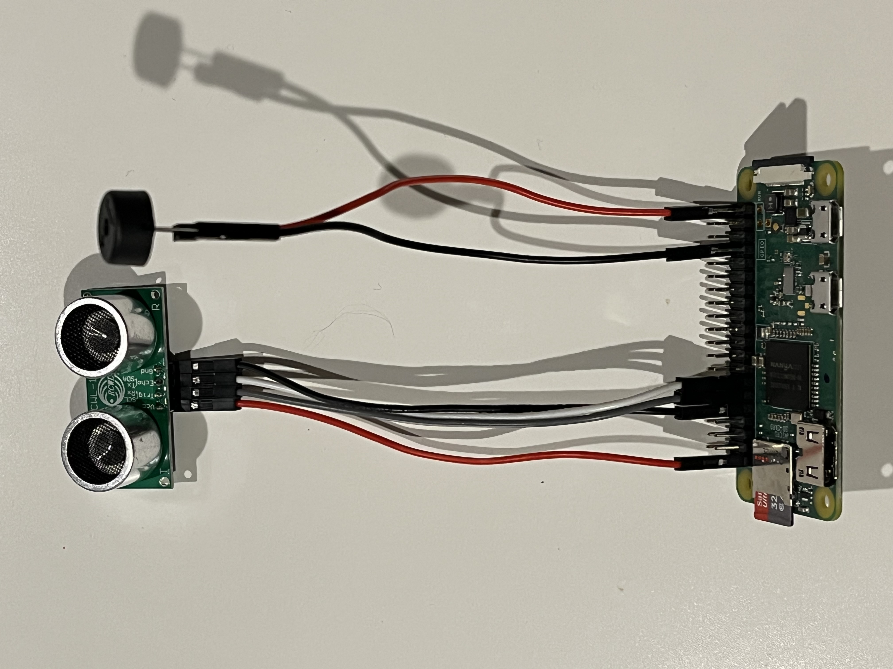
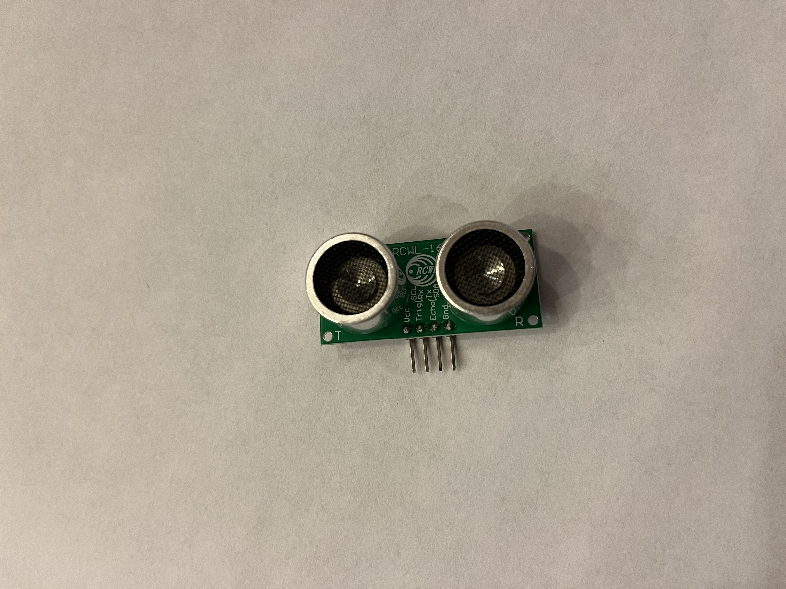
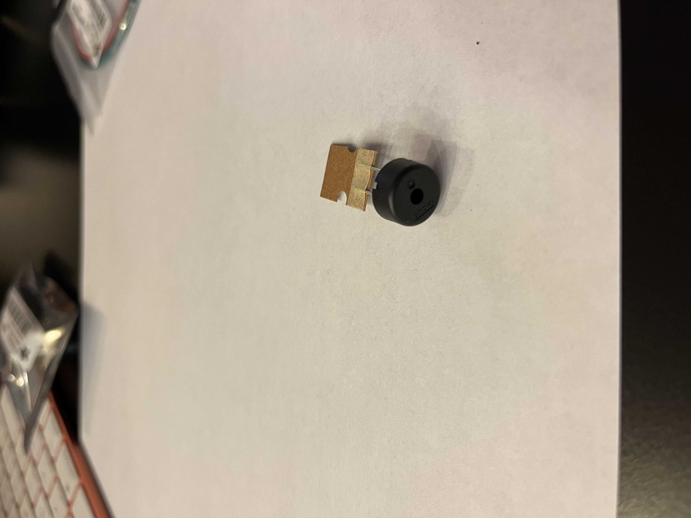

# Title
## Subtitle

This is my first raspberry pi project.

I followed [this youtube video](https://www.youtube.com/watch?v=yn59qX-Td3E&t=367s) to flash the SD card and start a headless set up

I used [this tutorial](https://projects.raspberrypi.org/en/projects/ultrasonic-theremin/5) for the first iteration of the project.
### Fixed Volume Theremin

#### Hardware:
 - Raspberry Pi Zero WH (Zero W with Headers)
 - Ultrasonic Distance Sensor - 3V or 5V - HC-SR04
 
    - VCC -> pin 1
    - TRIG -> pin 11 (GPIO 17)
    - ECHO -> pin 13 (GPIO 27)
    - GND -> pin 9
 - Piezo Buzzer (PS1240)
 
    - GND -> pin 34
    - other -> pin 40 (GPIO 21)

#### How it works:
1) RCWL-1601 gets the distance of an object in meters.
2) distance float value is converted to a tone
3) Buzzer produces the corresponding tone

